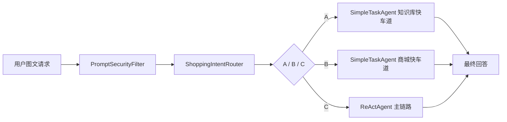

# 多模态电商智能导购 Agent

> 基于 Spring Boot + Spring AI 构建的多模态导购 Agent 原型，支持图文咨询、RAG 商品召回、MCP 商城工具调用、短期偏好记忆和安全工具编排。

| 维度 | 内容 |
| --- | --- |
| 入口 | `POST /api/react` |
| 路由 | 小模型 JSON 路由 + 快车道 |
| 记忆 | Redis 短期偏好 + MySQL 原文流水 + Milvus 长期摘要 |
| 工具 | `searchProductKnowledge`、`mall_*` MCP、WebSearch MCP |

## 架构速览



## 项目亮点

- 三段式意图路由：小模型 JSON 路由将请求分为 FAQ 快车道（A）、单步商城快车道（B）、复杂 ReAct 主链路（C），降低主模型调用频率。
- 商品 RAG：父子分块 + Milvus Dense + Sparse-BM25 混合召回，RRF 融合后截断噪声上下文。
- 工具安全边界：`PromptSecurityFilter` 前置注入过滤与敏感信息脱敏；`mall_create_order` 设有 Java 侧硬门禁，需用户显式确认后才放行。
- 分层记忆：Redis 短期窗口 + Milvus 长期摘要，短期偏好状态通过 `updateShoppingPreference` 工具维护。
- MCP 商城工具：`mall_*` 系列工具通过独立 `mall-mcp` 服务接入，不直连商城 REST。

### 技术栈

| 类别 | 技术 |
| --- | --- |
| 后端框架 | Spring Boot 3.4.1 / Java 17 |
| AI 框架 | Spring AI 1.1.4，OpenAI 兼容协议（DashScope） |
| 向量存储 | Milvus 2.5+，Dense + Sparse-BM25 |
| 缓存 | Redis（短期记忆、父块缓存、偏好、商城 token） |
| 关系型存储 | MySQL（原文会话流水） |
| 安全 | Spring Security Basic Auth + Form Login |
| 前端 | 原生 HTML / CSS / JavaScript |

## 快速启动

**前置依赖：** Docker Desktop、JDK 17、Maven 3.x

```powershell
# 1. 启动基础设施
docker compose up -d redis etcd minio milvus

# 2. 配置环境变量并启动后端
$env:DASHSCOPE_API_KEY="<your-key>"
mvn spring-boot:run

# 3. 启动前端（另开终端）
cd frontend
node server.js 4173
# 访问 http://localhost:4173
```

可选监控：`docker compose up -d prometheus grafana`（Grafana 默认 `admin/admin`）。

### MySQL 连接

```powershell
$env:MYSQL_URL="jdbc:mysql://localhost:3307/rag_agent?useUnicode=true&characterEncoding=utf8&serverTimezone=Asia/Shanghai&createDatabaseIfNotExist=true"
$env:MYSQL_USERNAME="root"
$env:MYSQL_PASSWORD="root"
```

### 主要环境变量

```powershell
$env:DASHSCOPE_API_KEY="<your-key>"
$env:REDIS_HOST="localhost"
$env:REDIS_PORT="6379"
$env:MILVUS_HOST="localhost"
$env:MILVUS_PORT="19530"
$env:SERVER_PORT="18082"
$env:SPRING_MVC_ASYNC_REQUEST_TIMEOUT="180s"
$env:SHOPPING_PREFERENCE_TTL="7d"
```

RAG 召回参数（均有默认值）：`RAG_DENSE_CHILD_TOP_K=24`、`RAG_BM25_CHILD_TOP_K=8`、`RAG_MAX_PARENT_RESULTS=6`。

购物意图路由模型默认 `qwen3-vl-8b-instruct`（置信度阈值 `0.7`），主模型默认 `qwen`（`qwen-plus-2025-07-28`）。完整配置见 `src/main/resources/application.yml`。

## 核心入口

### ReAct 图文对话

```http
POST /api/react
Authorization: Basic ...
Content-Type: multipart/form-data

message=帮我找这双鞋的相似款，预算500以内
image=@shoe.png
sessionId=shopping-demo
modelId=qwen
webSearchEnabled=false
```

也支持只传文本或传图片 URL：

```http
POST /api/react
Authorization: Basic ...
Content-Type: multipart/form-data

message=按这张图推荐通勤可穿的款式
imageUrl=https://example.com/images/shoe.png
sessionId=shopping-demo
```

### 导入商品知识

```http
POST /api/rag/documents/products/import
Authorization: Basic ...
Content-Type: application/json

{
  "productId": "P1001",
  "title": "云跑 AirLite 缓震跑步鞋",
  "brand": "Stride",
  "category": "运动鞋",
  "price": 499,
  "stock": 38,
  "description": "轻量中底，适合日常慢跑与城市通勤。",
  "attributes": { "颜色": "黑色", "尺码": "40-44" }
}
```

### 商城 MCP 工具

商城商品、购物车和普通订单通过独立 `mall-mcp` 服务暴露：

- MCP endpoint：`http://localhost:8120/mcp`
- 上下文接口：`http://localhost:8120/internal/mcp/mall/context`

可用工具：`mall_search_products`、`mall_get_product_detail`、`mall_add_to_cart`、`mall_view_cart`、`mall_prepare_order`、`mall_create_order`。

`mall_create_order` 有 Java 侧硬门禁：路由类型必须为 `CREATE_ORDER` 且参数包含有效 `confirmationId` 与 `userConfirmed=true` 才放行。

其他接口：`GET /api/models/chat`、`POST /api/rag/documents/import`。

## 文档索引

| 文档 | 说明 |
| --- | --- |
| [TESTING.md](TESTING.md) | 自动化与手工测试命令 |

深度技术文档（架构细节、存储设计、运行配置）将后续整理到 `docs/` 目录。

### 存储与记忆速览

- **Redis：** 父文档正文（`rag:parent:`）、短期记忆窗口（`memory:short:`）、导购偏好（`shopping:preference:`）、商城 token 缓存（`mall:auth:`）。
- **MySQL：** `conversation_sessions` + `conversation_turns`，保存用户提问和助手最终可见回答的原文流水。
- **Milvus：** `product_index`（商品知识库子块，Dense + Sparse-BM25）、`memory_index`（长期摘要）。

### 目录结构

```text
RAGAgent
├─ src/main/java/com/example/ragagent
│  ├─ config / controller / commerce
│  ├─ memory / rag / security
│  ├─ service        Agent、意图路由与模型注册
│  └─ tools          内置工具
├─ src/main/resources/application.yml
├─ src/test/java/com/example/ragagent
├─ frontend          独立静态前端
└─ pom.xml
```

## 测试概览

| 测试类 | 覆盖要点 |
| --- | --- |
| `ReActAgentTest` | 工具注册、模型切换、脱敏恢复、路由回退 |
| `ShoppingIntentRouterTest` | JSON 路由解析、图文 media 透传 |
| `ShoppingRouteExecutorTest` / `SimpleTaskAgentTest` | 快车道短路、限定工具、MCP 不可用失败 |
| `PromptSecurityFilterTest` | 注入过滤与敏感值恢复 |
| `ParentChildHybridDocumentRetrieverTest` | Dense + BM25 融合与截断 |
| `LongTermMemoryAdvisorTest` / `RedisChatMemoryRepositoryTest` | 短期窗口淘汰、长期摘要触发 |

完整自动化与手工测试命令见 [TESTING.md](TESTING.md)。
