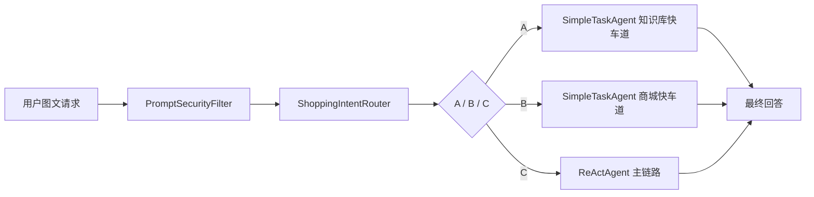

# 多模态电商智能导购 Agent

> 基于 Spring Boot + Spring AI 构建的多模态导购 Agent 原型，支持图文咨询、RAG 商品召回、MCP 商城工具调用、短期偏好记忆和安全工具编排。

| 维度 | 内容 |
| --- | --- |
| 入口 | `POST /api/react` |
| 路由 | 小模型 JSON 路由 + 快车道 |
| 记忆 | Redis 短期偏好 + MySQL 原文流水 + Milvus 长期摘要 |
| 工具 | `searchProductKnowledge`、`mall_*` MCP、WebSearch MCP |

## 架构速览



## 项目亮点

- **分层路由架构**：在 ReAct 主链路前增加 `ShoppingIntentRouter`，用小模型 JSON 路由把请求拆成 FAQ 快车道、单步商城工具快车道和复杂 ReAct 三类，降低简单任务对主模型和工具编排的依赖。
- **商品事实约束**：商品推荐、价格、库存、SKU 等事实信息优先来自 RAG 检索或 `mall_*` MCP 工具，避免把关键交易信息交给模型自由生成。
- **多层记忆设计**：Redis 承接短期对话窗口和导购偏好，偏好使用 Hash 保存当前状态、List 保存最近 5 次增量变化；MySQL 记录原文会话流水，Milvus 保存长期摘要向量，把“即时上下文、可追溯日志、长期记忆”拆成不同存储职责。
- **MCP 商城边界**：商城商品、购物车和订单能力通过独立 `mall-mcp` 服务暴露，Agent 侧只消费 MCP 工具，不直连商城 REST，便于隔离业务系统和 Agent 编排层。
- **安全工具编排**：`PromptSecurityFilter` 前置处理注入与敏感值脱敏，`mall_create_order` 在 Java 侧设置确认门禁，确保高风险工具调用不只依赖模型自觉。

### 技术栈

| 类别 | 技术 |
| --- | --- |
| 后端框架 | Spring Boot 3.4.1 / Java 17 |
| AI 框架 | Spring AI 1.1.4，OpenAI 兼容协议（DashScope） |
| 向量存储 | Milvus 2.5+，Dense + Sparse-BM25 |
| 缓存 | Redis（短期记忆、父块缓存、偏好、商城 token） |
| 关系型存储 | MySQL（原文会话流水） |
| 安全 | Spring Security Basic Auth + Form Login |
| 前端 | 原生 HTML / CSS / JavaScript |

## 快速启动

后端启动前需准备一个可访问的 MySQL：默认 `localhost:3307/rag_agent`，账号 `root/root`；非默认环境可设置 `MYSQL_URL`、`MYSQL_USERNAME`、`MYSQL_PASSWORD`。

```powershell
docker compose up -d redis etcd minio milvus
$env:DASHSCOPE_API_KEY="<your-key>"
mvn spring-boot:run
```

前端在另一个终端启动 `cd frontend; node server.js 4173`，访问 `http://localhost:4173`。后端默认端口 `18082`，本仓库的 `docker-compose.yml` 不包含 MySQL。

完整前置依赖、环境变量、Docker 依赖和健康检查见 [docs/runtime.md](docs/runtime.md)。

## 核心入口

### ReAct 图文对话

```http
POST /api/react
Authorization: Basic ...
Content-Type: multipart/form-data

message=帮我找这双鞋的相似款，预算500以内
image=@shoe.png
sessionId=shopping-demo
modelId=qwen
webSearchEnabled=false
```

也支持只传文本或传图片 URL：

```http
POST /api/react
Authorization: Basic ...
Content-Type: multipart/form-data

message=按这张图推荐通勤可穿的款式
imageUrl=https://example.com/images/shoe.png
sessionId=shopping-demo
```

### 导入商品知识

```http
POST /api/rag/documents/products/import
Authorization: Basic ...
Content-Type: application/json

{
  "productId": "P1001",
  "title": "云跑 AirLite 缓震跑步鞋",
  "brand": "Stride",
  "category": "运动鞋",
  "price": 499,
  "stock": 38,
  "description": "轻量中底，适合日常慢跑与城市通勤。",
  "attributes": { "颜色": "黑色", "尺码": "40-44" }
}
```

### 商城 MCP 工具

商城商品、购物车和订单经独立 `mall-mcp` 服务暴露，MCP endpoint 为 `http://localhost:8120/mcp`。工具清单、上下文接口、`mall_create_order` 硬门禁等细节见 [docs/architecture.md#mcp-边界](docs/architecture.md#mcp-边界)。

其他接口：`GET /api/models/chat`、`POST /api/rag/documents/import`。

## 文档索引

- [架构说明](docs/architecture.md)
- [运行说明](docs/runtime.md)
- [测试说明](TESTING.md)

## 测试概览

| 测试类 | 覆盖要点 |
| --- | --- |
| `ReActAgentTest` | 工具注册、模型切换、脱敏恢复、路由回退 |
| `ShoppingIntentRouterTest` | JSON 路由解析、图文 media 透传 |
| `ShoppingRouteExecutorTest` / `SimpleTaskAgentTest` | 快车道短路、限定工具、MCP 不可用失败 |
| `ShoppingStateServiceTest` / `ShoppingPreferencePromptRendererTest` | 偏好 Hash/List 存储、TTL、最近变化渲染 |
| `PromptSecurityFilterTest` | 注入过滤与敏感值恢复 |
| `ParentChildHybridDocumentRetrieverTest` | Dense + BM25 融合与截断 |
| `LongTermMemoryAdvisorTest` / `RedisChatMemoryRepositoryTest` | 短期窗口淘汰、长期摘要触发 |

完整自动化与手工测试命令见 [TESTING.md](TESTING.md)。
