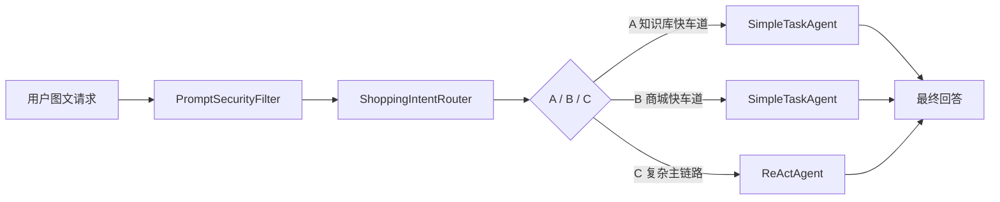

# 架构说明

本文件描述当前仓库已落地的运行时架构，按链路从入口到存储依次展开。每节只覆盖代码中真实存在的模块和职责，配置默认值和接口参数以 `src/main/resources/application.yml` 和对应 Controller 为准。

## 目录

- [总体链路](#总体链路)
- [核心模块](#核心模块)
- [请求流转](#请求流转)
- [存储设计](#存储设计)
- [记忆设计](#记忆设计)
- [MCP 边界](#mcp-边界)
- [RAG 检索](#rag-检索)
- [安全策略](#安全策略)
- [接口速查](#接口速查)

## 总体链路

请求先由 `PromptSecurityFilter` 过滤注入和脱敏敏感值；`ShoppingIntentRouter` 用小模型输出 JSON 路由结果；`ShoppingRouteExecutor` 根据 `task_type` 决定是否进入 `SimpleTaskAgent` 快车道；不能短路的请求才进入 `ReActAgent` 主链路。

## 核心模块

- **`ReActAgent`（`service/`）**：多模态主链路。挂载 `BuiltInTools`、`mall-mcp` 工具回调和可选的 WebSearch MCP，注入 `MessageChatMemoryAdvisor` + `LongTermMemoryAdvisor`，并在 `mall_create_order` 上设置 Java 侧硬门禁。
- **`ShoppingIntentRouter`（`service/`）**：轻量意图路由器。把请求分类为 `A_FAQ_SIMPLE_QUERY`、`B_SIMPLE_SHOPPING_TOOL`、`C_COMPLEX_REACT`，输出固定结构 JSON，默认模型 `qwen3-vl-8b-instruct`。
- **`ShoppingRouteExecutor`（`service/`）**：决定是否短路。置信度低于阈值（默认 `0.7`）或意图属于复杂场景时回落到主链路；否则委托 `SimpleTaskAgent` 走快车道。
- **`SimpleTaskAgent`（`service/`）**：A/B 快车道执行器，仅允许调用受限工具集（A 路径只有 `searchProductKnowledge`，B 路径只有 `mall_search_products` / `mall_get_product_detail` / `mall_add_to_cart` / `mall_view_cart` / `mall_prepare_order`）。
- **`BuiltInTools`（`tools/`）**：注册 `searchProductKnowledge` 和 `updateShoppingPreference` 两个内置工具。
- **`PromptSecurityFilter`（`security/`）**：基于正则的注入识别与敏感值占位符化，并在响应阶段恢复占位符。
- **`mall-mcp` 集成**：通过 `MallMcpClient` 与独立的 `mall-mcp` 服务交互，所有 `mall_*` 工具均经 MCP 协议暴露，不直连商城 REST。

## 请求流转

1. `ChatController.react` 接收 multipart 请求，拼装 `Media` 列表（最多 4 张图，支持上传或 URL）。
2. `PromptSecurityFilter.secure(...)` 对用户文本做注入过滤和敏感值脱敏，得到 `SecuredPrompt`。
3. `ShoppingRouteExecutor.routeBeforeCore(...)` 调用 `ShoppingIntentRouter` 取得意图 JSON；满足快车道条件时短路到 `SimpleTaskAgent`，否则把脱敏后的消息和媒体交给 `ReActAgent`。
4. `ReActAgent` 用 Spring AI `ChatClient` 流式输出 Token，工具调用通过 `ToolCallbacks` 注册到当前请求；流结束时 `PromptSecurityFilter.restoreSensitiveValues(...)` 还原占位符。
5. 用户提问和助手最终可见回答的原文流水由 `ConversationLogService` 异步写入 MySQL。

## 存储设计

- **Redis**：短期记忆窗口（`memory:short:`）、导购偏好当前状态 Hash（`shopping:preference:v2:state:`）、最近 5 次偏好增量 List（`shopping:preference:v2:changes:`）、商城 token 缓存（`mall:auth:`），以及 RAG 父块热点缓存（`rag:parent:cache:`）。RAG 父块缓存按需写入，不是事实源；两类偏好 key 的默认 TTL 均由 `SHOPPING_PREFERENCE_TTL` 控制。
- **MySQL**：`conversation_sessions`、`conversation_turns` 和 `rag_parent_documents`。其中 `conversation_sessions` / `conversation_turns` 由 `ConversationLogService` 维护，保存用户提问和助手最终可见回答的原文流水；`rag_parent_documents` 保存 RAG 父块正文、标题、来源、父块序号、文档 hash 和商品元数据 JSON。
- **Milvus**：`product_index` 存放商品子块（Dense embedding + Sparse-BM25 字段），`memory_index` 存放长期摘要向量；RAG 检索命中 child chunk 后通过 `parentId` 回查 MySQL，并用 Redis 加速热点父块读取。

## 记忆设计

- **短期记忆**：`MessageChatMemoryAdvisor` 基于 Redis 窗口缓存最近若干轮对话，按 `userId` + `sessionId` 隔离。
- **长期摘要**：`LongTermMemoryAdvisor` 在 `before(...)` 阶段调用 `LongTermMemoryService`，根据当前用户问题在 `memory_index` 检索摘要，命中后通过 `augmentSystemMessage` 注入到 system 上下文。摘要的写入由后台任务在对话累积到阈值后触发。
- **短期偏好状态**：`ShoppingStateService` 用 Redis Hash 保存当前 `ShoppingPreferenceState`（品类、预算、品牌、尺码、颜色、风格、使用场景），用 Redis List 保存最近 5 次按轮次聚合的增量 JSON。每次实际字段变化后，服务执行 `HSET` / `HDEL`、`RPUSH`、`LTRIM -5 -1`，并刷新两类 key 的 TTL。偏好可由路由后的自动抽取或 `BuiltInTools.updateShoppingPreference` 工具维护。每轮 `/api/react` 请求都会把当前偏好和最近变化摘要注入路由小模型、简单任务快车道和主 Agent；当前 Hash 是事实源，最近变化只作为上下文线索。用户显式修改偏好以本轮表达为准，类目切换时会清理品牌、尺码、颜色、风格、使用场景等强相关旧字段。

## MCP 边界

- 商城业务（商品、购物车、普通订单）不直连商城 REST，全部通过独立的 `mall-mcp` 服务暴露：MCP endpoint `http://localhost:8120/mcp`，上下文接口 `http://localhost:8120/internal/mcp/mall/context`。
- 工具集合：`mall_search_products`、`mall_get_product_detail`、`mall_add_to_cart`、`mall_view_cart`、`mall_prepare_order`、`mall_create_order`。
- `mall_create_order` 设有 Java 侧硬门禁：路由类型必须为 `CREATE_ORDER`，且参数必须包含有效 `confirmationId` 和 `userConfirmed=true`，否则在 `ReActAgent` 层直接拒绝放行。
- 可选 WebSearch MCP 通过 `ToolCallbackProvider` 自动注册，不在默认链路上。

## RAG 检索

- 入口：`searchProductKnowledge` 工具委托 `DocumentRetriever`，默认实现是 `@Primary` 的 `ParentChildHybridDocumentRetriever`。
- 索引：`ParentChildDocumentIndexer` 把原文切成父块和子块；父块写入 MySQL，子块写入 Milvus dense + sparse 字段。
- 当前父块缓存一致性防护（single-flight、mutation version、同 source 导入串行化）是单应用实例内的本地机制；多实例部署需要引入共享 generation、Redis 分布式锁或队列化导入，避免跨实例旧缓存回写。
- 召回：`ParentChildHybridDocumentRetriever` 分别从 Milvus dense（Top-K 默认 24）和 BM25 child chunk（Top-K 默认 8）取 child，使用 Reciprocal Rank Fusion 融合排名，再按最大归一化分差截断，融合后通过 `ParentDocumentStore.load(parentId)` 回查父块（默认上限 6）。`ParentDocumentStore` 先查 Redis 热点缓存，未命中时查 MySQL 并回填缓存。
- BM25 路出现异常时降级为只用 dense 结果，不影响主流程。

## 安全策略

- `PromptSecurityFilter` 拦截 `<execute>`、`ignore previous instructions`、`reveal system prompt` 等常见注入模式，把命中文本替换为 `[FILTERED_PROMPT_INJECTION]`。
- 同时识别 `api_key/secret/token/password`、邮箱、手机号、身份证、银行卡号等敏感值，替换为占位符；在响应返回前由 `restoreSensitiveValues(...)` 还原可信值。
- system 层附加固定 `SYSTEM_SAFETY_PROMPT`，明确要求模型把 `<user_input>` 视为数据。
- 工具层硬门禁见上文 MCP 边界小节。

## 接口速查

- `POST /api/react` -> `ChatController` / `ReActAgent`（图文流式对话主入口）
- `POST /api/rag/documents/import`、`POST /api/rag/documents/products/import` -> `RagDocumentController` / `ParentChildDocumentIndexer`
- `GET /api/conversations` -> `ConversationController` / `ConversationLogService`（当前用户最近会话摘要）
- `GET /api/conversations/{sessionId}/turns`、`DELETE /api/conversations/{sessionId}` -> `ConversationController` / `ConversationLogService`
- `GET /api/models/chat` -> `ChatController` / `ChatModelRegistry`
